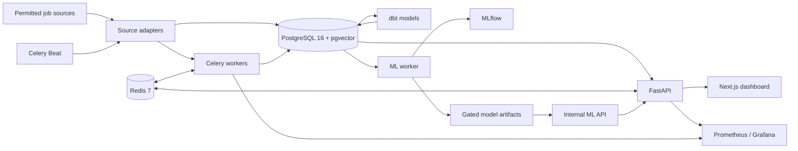

# JobRadar VN

Vietnamese technology job-market intelligence built around traceable data,
deterministic normalization, and explicit release gates.

JobRadar VN collects permitted public job postings, normalizes titles, skills,
experience, and disclosed salaries, then serves job discovery, market analytics,
salary benchmarks, matching, and alerts through a FastAPI API and a Vietnamese
Next.js dashboard.

> **Project status:** the measured MVP is complete and runs locally. The latest
> salary-model candidate is intentionally **not published** because its temporal
> holdout MAPE is 33.78%, above the 15% release gate, and the required salary
> history is not yet mature. Live Hetzner deployment also remains pending. See
> the [completion audit](docs/completion_audit.md) for current evidence.

## Capabilities

| Area | What is implemented |
|---|---|
| Job discovery | Cursor-paginated search with title, skill, location, level, salary, and source filters |
| Data collection | Robots-aware, fail-closed adapters for ITViec, TopCV, VietnamWorks, and the official LinkedIn API path |
| NLP | Bilingual title normalization, experience parsing, salary normalization, and a versioned 3,336-entry skill taxonomy |
| Market intelligence | Hiring trends, skill demand, salary bands, company activity, and dbt-backed analytics marts |
| Personalization | Encrypted CV extraction, pgvector similarity, deterministic skill matching, and role-level skill-gap analysis |
| Salary intelligence | Observed market quantiles plus a leakage-safe quantile model that is served only after publication gates pass |
| Alerts | Owned alert rules, scheduled matching, durable delivery history, and optional email or Telegram delivery |
| Operations | Prometheus metrics, Grafana dashboards, MLflow tracking, backups, rate limiting, health probes, and rollback-aware CD |

## Measured Status

The repository distinguishes implemented behavior from production claims.
Current acceptance results are recorded in
[`docs/completion_audit.md`](docs/completion_audit.md).

| Gate | Result |
|---|---:|
| Backend unit and integration tests | 216 passed |
| Combined API, NLP, scraper, and ML coverage | 81.03% |
| dbt build | 32/32 passed |
| Isolated `/api/jobs` load test | 100 RPS target, 8.37 ms p95, 0% HTTP failures |
| Frontend E2E | 3 Playwright workflows passed on desktop/mobile paths |
| Salary publication | Blocked: 33.78% MAPE vs. 15% maximum |
| Live production deployment | Not yet executed |

## Architecture

JobRadar is a modular monolith deployed as independently executable web, API,
worker, analytics, and ML processes. PostgreSQL is the durable source of truth;
Redis holds disposable queue and cache state.



The detailed runtime flow, security boundaries, and architectural decisions are
documented in [`docs/architecture.md`](docs/architecture.md).

## Technology Stack

| Layer | Technologies |
|---|---|
| Web | Next.js 16, React 19, TypeScript 5, Recharts, Playwright |
| API | Python 3.12+, FastAPI, Pydantic, SQLAlchemy async, Alembic |
| Storage | PostgreSQL 16, pgvector HNSW, pgcrypto, Redis 7 |
| Data and orchestration | Celery, dbt-postgres, Prefect-compatible flows, allowlisted Playwright rendering |
| NLP and ML | deterministic parsers, Sentence Transformers, XGBoost quantile regression, MLflow |
| Observability | Prometheus, Grafana, structured logs, health/readiness probes |
| Delivery | Docker Compose, GitHub Actions, GHCR, Terraform, Hetzner Cloud, Caddy |

## Quick Start

### Prerequisites

- Docker 24+ with Docker Compose v2
- At least 8 GB RAM recommended for the complete local stack
- `uv` and Node.js 22 only when running services outside Docker

### Start the application

```bash
cp .env.example .env
docker compose up --build -d
docker compose ps
```

The one-shot migration and salary-data services must exit successfully before
the API and workers start. Verify readiness with:

```bash
curl --fail http://localhost:8000/health/ready
```

| Service | URL |
|---|---|
| Dashboard | <http://localhost:3000> |
| API documentation | <http://localhost:8000/docs> |
| MLflow | <http://localhost:5000> |

Load clearly labeled development data when the UI needs a local fixture:

```bash
docker compose exec api python scripts/seed_demo.py
```

Demo rows are never valid evidence for scraper, salary-model, or performance
readiness gates.

### Collect operational data

The operational salary input is disclosed compensation from permitted job
postings collected by the source adapters. It is not a dataset that an operator
must supply manually. The bundled VietJobs and TopCV derivatives provide 1,933
provenance-pinned historical observations. They retain only publisher-supplied
record dates and therefore cannot manufacture missing monthly coverage or
satisfy the salary readiness gate by themselves.

After reviewing the current source policy, enable only the approved adapters in
`.env`. For a workstation that must accumulate operational observations across
host and Docker restarts, start the stack with the collector overlay:

```bash
# Set only reviewed sources to true in .env and use a monitored contact mailbox.
# ENABLE_ITVIEC_SCRAPER=true
# ENABLE_TOPCV_SCRAPER=true
# ENABLE_VIETNAMWORKS_SCRAPER=true
# SCRAPER_CONTACT_EMAIL=bot@example.com
docker compose -f compose.yaml -f compose.collector.yaml up -d
curl --fail --request POST \
  --header "X-Admin-Key: $ADMIN_API_KEY" \
  "http://localhost:8000/api/admin/scrape/trigger?platform=topcv&pages=10"
```

The overlay applies `restart: unless-stopped` only to long-running services;
migrations and idempotent salary-data import remain one-shot prerequisites.
Use `docker compose down` when collection should stop intentionally.

TopCV is fetched with the declared bot identity first. If its public listing
requires JavaScript or returns managed challenge markup, the adapter uses an
allowlisted headless Chromium context whose browser-compatible user-agent still
contains that identity and whose `From` header contains `SCRAPER_CONTACT_EMAIL`.
Robots authorization and the shared five-second top-level page delay still run
before every render. The adapter does not use proxies or solve CAPTCHAs and
fails closed if public cards are unavailable.

Each source posting remains one salary sample even when it is scraped repeatedly.
A later payload with hidden compensation cannot erase a valid disclosed range,
and a historical TopCV row is merged with the matching live `platform_job_id`
instead of becoming a second training sample. Inactive postings remain available
only to the time-bounded salary dataset.
Inspect collection batches at `GET /api/admin/scrape/batches` and model coverage
at `GET /api/admin/ml/data-readiness`.

### Add monitoring

```bash
docker compose \
  -f compose.yaml \
  -f compose.monitoring.yaml \
  up -d
```

Prometheus is available at <http://localhost:9090> and Grafana at
<http://localhost:3001>. Replace all default credentials before using a shared
or production environment.

### Stop the stack

```bash
docker compose \
  -f compose.yaml \
  -f compose.monitoring.yaml \
  down
```

Do not add `--volumes` unless deleting local PostgreSQL, Redis, Grafana, MLflow,
and model state is intentional.

## Development

### Backend

```bash
uv sync --extra dev --extra analytics --extra ml --extra scraping
uv run playwright install --only-shell chromium
docker compose up -d db redis
uv run alembic upgrade head
uv run uvicorn api.main:app --reload
```

### Frontend

```bash
cd web
npm ci
npm run dev
```

The browser uses same-origin `/api` requests. During local development, Next.js
proxies those requests to the API configured in `web/next.config.mjs`.

## Quality Gates

Run the same primary checks enforced by CI:

```bash
uv run ruff check .
uv run ruff format --check .
uv run mypy --strict api nlp scrapers workers ml flows scripts
uv run pytest --cov=api --cov=nlp --cov=scrapers --cov=ml --cov-fail-under=70

DBT_HOST=localhost uv run dbt source freshness \
  --project-dir analytics --profiles-dir analytics
DBT_HOST=localhost uv run dbt build \
  --project-dir analytics --profiles-dir analytics

cd web
npm audit --audit-level=high
npm run lint
npm run typecheck
npm run build
npm run test:e2e
```

CI also validates migrations, the skill benchmark, Terraform, Compose contracts,
Prometheus rules, Grafana dashboards, container builds, and the checked-in salary
evaluation evidence.

## API Overview

The OpenAPI schema is generated at `/openapi.json`; interactive documentation is
served at `/docs`.

| Scope | Representative endpoints |
|---|---|
| Jobs | `GET /api/jobs`, `GET /api/jobs/{id}`, `GET /api/jobs/{id}/similar` |
| Salary | `GET /api/salary/bands`, `GET /api/salary/benchmark/{title}`, `POST /api/salary/predict` |
| Analytics | `GET /api/analytics/skills/demand`, `GET /api/analytics/hiring/trends` |
| Authentication | `POST /api/auth/register`, `POST /api/auth/login`, `POST /api/auth/refresh` |
| Profile and matching | `PUT /api/profile`, `POST /api/profile/cv`, `GET /api/profile/matching-jobs` |
| Alerts | `POST /api/alerts`, `PUT /api/alerts/{id}`, `GET /api/alerts/{id}/history` |
| Operations | `/health/ready`, `/metrics`, and admin-key-protected `/api/admin/*` routes |

See [`docs/api.md`](docs/api.md) for authentication, pagination, privacy, and
rate-limit behavior.

## Salary Model Governance

The ML service fails closed. Training writes a candidate artifact, logs the run
to MLflow, and publishes `artifacts/salary/current` only when all release gates
pass. The main-branch publication job requires:

- finite row-level metrics from a temporal holdout of at least 50 observations;
- MAPE at or below 15%;
- an automated salary-data readiness report with sufficient monthly and segment
  coverage; and
- a 40-character source revision that identifies a real Git commit reachable
  from the evaluated repository `HEAD`.

The current candidate remains rejected, so the API returns observed market
quantiles with source and period provenance or a deterministic cold-start
fallback. After importing both pinned snapshots and deduplicating matching live
jobs, the current retraining pool has 2,285 rows across five months, 948
canonical technical rows and 222 rows in the latest month. It still fails the
six-month, 1,000-row and segment-coverage gates, so no new final holdout was
consumed and no model was published. Full methodology and limitations are in the
[`salary model card`](docs/salary_model_card.md); machine-readable evidence is
checked in at
[`docs/evidence/salary_evaluation.json`](docs/evidence/salary_evaluation.json).

## Security and Data Policy

- Source adapters are disabled by default and must pass a current access-policy
  review before collection is enabled.
- Shared controls enforce `robots.txt`, a declared research user agent,
  per-domain throttling, response caching, and fail-closed schema validation.
- The system stores public job-posting data, not candidate profiles from source
  platforms.
- User CV text is encrypted with pgcrypto AES-256, isolated with PostgreSQL RLS,
  excluded from analytics, and removable through the authenticated API.
- Passwords use Argon2id; access and refresh tokens are HttpOnly cookies; admin
  routes require a separate key.
- Production rejects placeholder secrets and exposes PostgreSQL, Redis, MLflow,
  and monitoring only on the private Compose network.

Historical datasets and taxonomies retain their upstream licenses and provenance.
Review [`docs/third_party.md`](docs/third_party.md) and [`licenses/`](licenses/)
before redistribution. This repository does not grant a project-wide
open-source license unless a root `LICENSE` file is added explicitly.

## Repository Layout

```text
api/          FastAPI routers, schemas, services, and security controls
analytics/    dbt sources, staging models, marts, tests, and freshness rules
flows/        Orchestration entry points
infra/        Terraform, cloud-init, Caddy, Prometheus, and Grafana config
migrations/   Append-only Alembic revisions
ml/           Salary training, evaluation, serving, embeddings, and matching
nlp/          Salary, title, experience, and skill normalization
scrapers/     Source adapters plus shared ethical collection controls
scripts/      Imports, backfills, validation, backup, and deployment tooling
tests/        Unit, integration, Playwright, and k6 coverage
web/          Next.js application
workers/      Celery schedules and background tasks
```

## Deployment

Production delivery is prepared for a Hetzner CX32-class host. Terraform creates
the protected host and firewall; cloud-init configures a non-root deployment
account; Caddy terminates TLS; GitHub Actions builds commit-addressed GHCR images
and deploys immutable release directories with smoke testing and rollback.

No live deployment is claimed in this repository. Provisioning requires an
owner-approved Terraform apply, DNS, GitHub Environment secrets, and a verified
public smoke test. Follow [`docs/operations.md`](docs/operations.md) for the
complete deployment, backup, restore, rotation, and rollback runbook.

## Documentation

- [Implementation plan](implementation_plan.md)
- [Architecture](docs/architecture.md)
- [API contracts](docs/api.md)
- [Data dictionary](docs/data_dictionary.md)
- [Operations runbook](docs/operations.md)
- [Salary model card](docs/salary_model_card.md)
- [Completion audit](docs/completion_audit.md)
- [Third-party data and attribution](docs/third_party.md)
