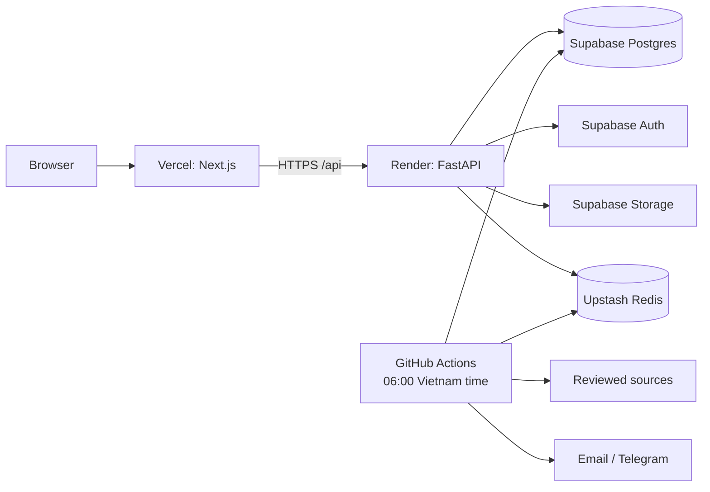

# JobRadar VN

[](https://github.com/auster-vn/JobRadar/actions/workflows/ci.yml)
[](https://github.com/auster-vn/JobRadar/actions/workflows/daily-pipeline.yml)

JobRadar is a Vietnamese technology-job intelligence and candidate workspace.
It combines normalized job discovery, private candidate profiles, application
tracking, explainable fit scoring, salary evidence, and alerts in one system.

The primary deployment is designed for low-cost managed infrastructure:
Vercel, a Render free web service, Supabase Postgres/Auth/Storage, Upstash Redis,
and a GitHub Actions daily worker. The established multi-service Docker,
analytics, MLflow, Prometheus/Grafana, and private-cloud deployment remains
available as an optional advanced path.

[](https://render.com/deploy?repo=https%3A%2F%2Fgithub.com%2Fauster-vn%2FJobRadar)
[](https://vercel.com/new/clone?repository-url=https%3A%2F%2Fgithub.com%2Fauster-vn%2FJobRadar&env=API_INTERNAL_URL%2CNEXT_PUBLIC_API_URL)

Deploy the API first so its Render URL can be supplied to Vercel. The buttons
still require your own provider accounts and secret values; no credentials are
embedded in the repository.

## Product features

- Responsive job search, filtering, detail pages, and salary insights
- Email/password authentication mediated through Supabase Auth
- Tenant-isolated candidate profiles and private CV storage
- Application tracking from saved through offer/rejected/withdrawn states
- Explainable per-user job scores with persistent input-hash caching
- Deterministic free scoring plus OpenAI, DeepSeek, OpenRouter, Gemini, and
  local Ollama adapters
- Configurable job alerts with email/Telegram delivery history
- Bounded, opt-in source ingestion with normalized results and failure isolation
- Pipeline, notification, and security audit records
- Health/readiness endpoints, structured logs, Prometheus metrics, rate limits,
  and cache fallbacks
- Alembic migrations, Supabase RLS/Storage policy reconciliation, CI security
  scans, browser tests, and an 80% backend coverage gate

Job scores are advisory and do not make hiring decisions. Scrapers are disabled
until an operator reviews each source's terms and robots policy.

## Architecture



The API is stateless. PostgreSQL and Storage are authoritative; Redis is
disposable cache/rate-limit/optional queue state. The free scheduled path runs a
tracked CLI in GitHub Actions, so it does not depend on an always-on Celery
worker. A protected queue endpoint is available for deployments that provision
continuous worker capacity.

### Technology

| Layer | Stack |
| --- | --- |
| Web | Next.js 16, React 19, TypeScript, Recharts, Playwright |
| API | Python 3.12, FastAPI, Pydantic, async SQLAlchemy |
| Data | PostgreSQL 16, pgvector, Alembic, Supabase RLS |
| Cache/queue | Redis/Upstash, optional Celery |
| Automation | GitHub Actions daily CLI and CI/CD |
| Analytics/ML | dbt, sentence-transformers, XGBoost, MLflow (optional) |
| Observability | JSON logs, health/readiness, Prometheus metrics |

## Managed deployment

Follow [DEPLOYMENT.md](DEPLOYMENT.md). In short:

1. Create Supabase and copy transaction-pooler/runtime plus
   direct/session-pooler migration URLs.
2. Create Upstash Redis and copy its TLS TCP URL.
3. deploy `render.yaml`; startup applies Alembic and the Supabase Auth/RLS/
   Storage layer;
4. deploy root `vercel.json` with both `API_INTERNAL_URL` and
   `NEXT_PUBLIC_API_URL` pointing to Render;
5. configure the GitHub `production` environment and manually test the daily
   workflow;
6. add the final Vercel origin to Render CORS and Supabase redirect settings.

The repository contains no live cloud URL and makes no claim that a particular
fork is currently deployed. Readiness must be proven against the operator's
accounts.

## Local development

### Docker

Prerequisite: Docker Desktop or Docker Engine with Compose v2.

```bash
cp .env.example .env
docker compose up --build
```

`compose.yaml` is the canonical development stack.
`docker-compose.yml` is a compatibility entrypoint and includes the same file.
The full stack includes PostgreSQL, Redis, API/web, workers, analytics/ML
services, and seeded salary data, so its first build is intentionally larger
than the managed API image.

For the application-facing subset:

```bash
docker compose up --build db redis migrate salary-data api web
```

Open:

- Web: <http://localhost:3000>
- API docs: <http://localhost:8000/docs>
- Readiness: <http://localhost:8000/health/ready>

Stop without deleting volumes:

```bash
docker compose down
```

### Native backend

Prerequisites: Python 3.12, uv, PostgreSQL with pgvector, and Redis.

```bash
cp .env.example .env
uv sync --frozen --extra dev
uv run alembic upgrade head
uv run uvicorn api.main:app --reload
```

### Native frontend

Node.js 24 is required:

```bash
npm --prefix web ci
API_INTERNAL_URL=http://localhost:8000 \
NEXT_PUBLIC_API_URL=http://localhost:8000 \
npm --prefix web run dev
```

## Environment contract

`.env.example` is the complete non-secret template. Important groups:

| Variables | Purpose |
| --- | --- |
| `DATABASE_URL` | async runtime URL; transaction pooler in production |
| `MIGRATION_DATABASE_URL` | direct/session-pooler URL for Alembic and Supabase SQL |
| `SUPABASE_URL`, `SUPABASE_KEY` | production Auth project and anon key |
| `SUPABASE_SERVICE_ROLE_KEY` | server-only Storage/admin access |
| `SUPABASE_JWT_SECRET` | optional legacy HS256 verification |
| `SUPABASE_STORAGE_BUCKET` | private candidate-file bucket |
| `REDIS_URL` | TLS Upstash URL in production |
| `UPSTASH_REDIS_REST_URL/TOKEN` | optional REST cache transport |
| `JWT_SECRET` | application signing secret; `JWT_SECRET_KEY` is the legacy alias |
| `ADMIN_API_KEY` | privileged admin endpoints |
| `CV_ENCRYPTION_KEY` | pgcrypto CV-text encryption passphrase |
| `CRON_SECRET` | only the optional `/api/cron/*` trigger |
| `NEXT_PUBLIC_API_URL`, `API_INTERNAL_URL` | browser and SSR/rewrite API origins |
| `AI_PROVIDER`, `AI_MODEL`, `AI_TOKEN_BUDGET` | provider and cost controls |
| `DAILY_RECOMMENDATION_*` | bounded users/jobs, top count, and score threshold |
| provider API keys | optional; configure only providers in use |
| scraper flags/contact | opt-in source authorization and identity |

Production secrets must be independent values. Never give
`SUPABASE_SERVICE_ROLE_KEY`, database/Redis credentials, or AI keys a
`NEXT_PUBLIC_` prefix.

See [AI_PROVIDER.md](AI_PROVIDER.md) for provider-specific configuration and
fallback behavior.

## Daily automation

The default workflow runs at 23:00 UTC, which is 06:00 in Vietnam:

```bash
PIPELINE_IDEMPOTENCY_KEY=daily:2026-08-15 \
uv run python -m scripts.run_daily_pipeline
```

It tracks `pipeline_runs`, runs bounded enabled sources with isolation,
deduplicates/upserts jobs, ranks bounded user/job sets with deterministic
no-LLM scoring, persists qualifying recommendations as scores/in-app
notifications, expires stale listings, evaluates alerts, and records details.
All source flags default to false.

`POST /api/cron/daily` is optional and requires `X-Cron-Secret` plus an
8–128 character `Idempotency-Key`. It queues Celery work and therefore is not
used by the free default, which has no continuous worker. It never uses the
admin key as cron authentication.

## API overview

Canonical REST routes are under `/api`, with compatibility aliases for the
goal-level paths where applicable:

- `POST /api/auth/register`, `POST /api/auth/login`, and session routes
- `GET /api/jobs`, `GET /api/jobs/{id}`
- `POST /api/jobs/{id}/score`
- `GET|POST|PATCH /api/applications`
- `GET|PUT /api/profile` and CV upload/delete
- salary insights, skills, matches, and alerts
- `GET /health`, `GET /health/ready`, `GET /version`
- protected `GET /metrics`

Use the generated OpenAPI page at `/docs` or [docs/api.md](docs/api.md) for
request details.

## Quality gates

Run the same critical checks before opening a pull request:

```bash
uv sync --frozen --extra dev --extra analytics --extra ml --extra scraping
uv run ruff check .
uv run ruff format --check .
uv run mypy api nlp scrapers workers ml flows scripts
uv run pytest --cov=api --cov=nlp --cov=scrapers --cov=ml --cov-fail-under=80

npm --prefix web ci
npm --prefix web run lint
npm --prefix web run typecheck
npm --prefix web run build
```

CI also runs PostgreSQL/Redis integration tests, browser flows, dbt checks,
Terraform/Compose/manifest validation, dependency audits, a Trivy
vulnerability/secret/misconfiguration scan, and managed Docker builds.

## Security notes

- Supabase Auth identities are projected into `public.users`; password material
  is never copied.
- Private table policies accept `auth.uid()` or the API's transaction-local
  `app.user_id`, preserving isolation in both access modes.
- The `candidate-files` bucket is private, limited to 6 MiB and allowlisted
  MIME types; keys begin with the owning user UUID.
- CV text stored in PostgreSQL is encrypted with pgcrypto.
- Production rejects wildcard CORS and unsafe/default/duplicate secrets.
- API inputs, external AI JSON, source URLs, file types, and sizes are validated.
- Operational tables are not exposed to anon/authenticated PostgREST roles.

Report a suspected credential leak privately and rotate the credential before
publishing incident details.

## Troubleshooting

### Render starts but readiness is 503

Read the JSON body. Verify the runtime transaction-pooler URL, Upstash TLS URL,
project pause/quota, database revision, and pool size. `/health` alone is not a
readiness check.

### Vercel calls localhost or returns rewrite errors

Set both `API_INTERNAL_URL` and `NEXT_PUBLIC_API_URL` for the relevant Vercel
environment, then redeploy. Do not include a trailing slash.

### Login fails

Verify `AUTH_MODE=supabase`, the Supabase URL/anon key, email-provider settings,
and exact Render CORS origins. The backend exposes an OAuth initiation route,
but the current web app does not implement `/auth/callback`; OAuth must remain
disabled until a callback/session handoff is added and tested.

### Daily pipeline has no jobs

Source flags intentionally default to false. Review source authorization first,
then set flags/contact variables in the GitHub `production` environment.
Inspect `pipeline_runs`, `scrape_batches`, and the workflow log.

### CV upload fails

Check the service-role key, bucket policy, UUID object path, 6 MiB limit, and MIME
allowlist. Do not make the bucket public to work around a policy error.

The full incident and recovery procedures are in
[docs/OPERATIONS.md](docs/OPERATIONS.md).

## Repository layout

```text
api/                    FastAPI routes, security, models, services
web/                    Next.js application and browser tests
migrations/             Alembic application schema
database/               Supabase Auth/RLS/Storage reconciliation
scrapers/, nlp/         source adapters and normalization
workers/, flows/        task and tracked-pipeline orchestration
analytics/, ml/         optional dbt and salary/NLP workloads
docker/                 managed backend/frontend images
infra/                  monitoring and optional Terraform/self-host assets
.github/workflows/      CI, daily pipeline, release, and legacy deploy automation
```

## Contributing

1. Create a focused branch.
2. Keep secrets and generated/private data out of the repository.
3. Add or update tests for behavior changes.
4. Run the relevant quality gates above.
5. Document environment, migration, API, or operational changes.
6. Open a pull request and wait for all required checks.

Database changes require an Alembic revision plus a review of Supabase
RLS/grants. Scraper changes require fixtures, bounded retries/timeouts, stable
result contracts, and a fresh policy review.

## Documentation

- [Managed deployment](DEPLOYMENT.md)
- [Managed operations](docs/OPERATIONS.md)
- [AI providers and cost controls](AI_PROVIDER.md)
- [Refactor audit and architecture plan](docs/REFACTOR_PLAN.md)
- [API](docs/api.md)
- [Architecture](docs/architecture.md)
- [Data dictionary](docs/data_dictionary.md)
- [Salary model card](docs/salary_model_card.md)
- [Third-party data and licenses](docs/third_party.md)
- [Legacy self-hosting](docs/SELF_HOSTING.md)
