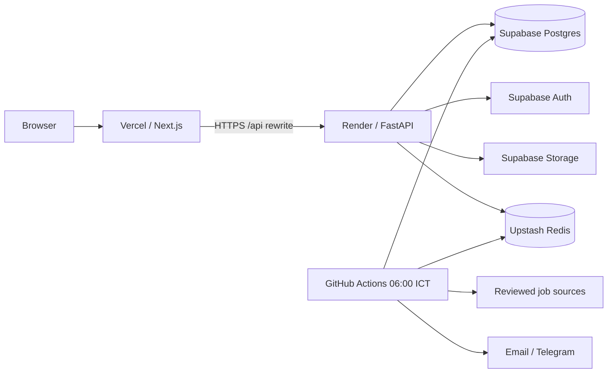

# JobRadar managed SaaS refactor plan

Last reviewed: 2026-08-15

## Objective

Move JobRadar from a workstation-oriented research stack to a deployable,
low-cost SaaS without discarding the existing analytics, ML, observability, or
self-hosted workflows. The primary target is:

- Next.js on Vercel
- FastAPI on a Render free web service
- Supabase Postgres, Auth, and Storage
- Upstash Redis
- GitHub Actions for the daily batch pipeline

The managed path has no required local database, Redis process, browser, worker,
or MLflow server. The larger Docker stack remains available for operators who
need continuous workers, Prometheus/Grafana, dbt, and salary-model training.

## Audited starting point

The repository already had substantial domain functionality:

- FastAPI, async SQLAlchemy, Alembic, PostgreSQL/pgvector, and Redis
- Next.js with server-side API rewrites
- ethical source adapters with validation and normalized result contracts
- Celery tasks for scraping, embeddings, alerts, analytics, and ML
- a multi-service Compose topology with monitoring and private self-host ingress
- unit, integration, browser, analytics, infrastructure, and release workflows

The main production gaps were in the delivery boundary rather than the core
research logic:

| Area | Finding | Impact |
| --- | --- | --- |
| Hosted deployment | No root Vercel or Render manifest | Deployment depended on manual dashboard knowledge |
| Database ownership | Alembic existed, but no Supabase Auth/RLS/Storage reconciliation | Managed Auth identities and tenant isolation were not reproducible |
| Runtime URLs | The web needs both `API_INTERNAL_URL` and `NEXT_PUBLIC_API_URL` | SSR/build rewrites could silently target localhost |
| Background jobs | Celery Beat assumed an always-on worker | A free Render web service cannot provide the continuous worker topology |
| Secrets | The example environment omitted several production settings | Operators could launch with incomplete or ambiguous configuration |
| Images | The root API image included Chromium and scraper dependencies | API memory, build time, and attack surface were unnecessarily large |
| CI policy | Backend coverage gate was 70%; no repository misconfiguration/secret scan | The stated 80% critical-path and security gates were not enforced |
| Runbooks | The main operations guide was self-host-first | Free-tier deployment and incident response were not discoverable |

## Target architecture

The API is stateless. Durable state lives in Supabase. Cache and rate-limit state
lives in Upstash. The scheduled workflow runs the tracked daily CLI directly, so
it does not require a continuously running Celery worker. It records one
idempotent `pipeline_runs` row per UTC processing date and continues independent
steps after source-level failures. Its managed daily path is fetch/deduplicate →
bounded deterministic scoring/recommendations → alerts/notifications. The
authenticated cron endpoint is an optional queue trigger for deployments that
provision a real Celery worker.

## Schema and migration strategy

Alembic remains authoritative for application tables and indexes:

1. `001_initial_schema` through `007_dedupe_salary_sources` establish the
   original catalogue, profile, alert, embedding, and salary domains.
2. `008_saas_domains` adds Applications, JobScores, PipelineRuns, Settings,
   Notifications, AuditLogs, and the Storage path on profiles.
3. `database/schema.sql` applies the idempotent managed Supabase layer after
   Alembic: Auth synchronization, dual-mode owner resolution, RLS/grants,
   security-invoker views, and a private Storage bucket.

The Supabase SQL refuses to run until Alembic has created the 008 managed-domain
contract, while permitting later Alembic descendants. This prevents two
migration systems from racing to create the same tables. Render and the daily
workflow apply both layers in order.

Runtime traffic uses the Supabase transaction pooler with small SQLAlchemy pools
and disabled asyncpg statement caching. Alembic and `psql` use the direct
connection or session pooler through `MIGRATION_DATABASE_URL`.

## Security model

- Supabase is the production identity authority; local JWT auth remains for
  development and the legacy self-hosted path.
- A trigger projects `auth.users` into `public.users`; no Supabase password
  material enters the application schema.
- Private tables resolve ownership from either `auth.uid()` or the API's
  transaction-local `app.user_id`.
- Anon/authenticated database grants start from least privilege.
- Candidate files are private, limited to 6 MiB and allowlisted MIME types, with
  user UUIDs as the first object-key segment.
- Render receives server credentials; Vercel receives only public API/Supabase
  values. The service-role key is never a `NEXT_PUBLIC_*` variable.
- Production startup rejects default, short, duplicated secrets and wildcard
  CORS.

## Delivery phases

### Phase 1 — audit and contract

Status: complete.

- Recorded the current and target architectures.
- Unified the environment contract in `.env.example`.
- Preserved legacy Compose and runbooks as an optional path.

### Phase 2 — application domains

Status: complete in the Alembic/API refactor.

- Added application tracking, job-score caching, pipeline history, per-user
  settings, notifications, audit events, and Storage references.
- Added Supabase/JWT, cache, AI-provider, logging, health, and pool settings.

### Phase 3 — managed infrastructure

Status: complete in repository configuration.

- Added slim managed backend/frontend Dockerfiles.
- Added the Render Blueprint, root Vercel configuration, Compose compatibility
  entrypoint, Supabase migration layer, and daily workflow.
- Made the 80% backend coverage threshold and repository security scan CI gates.

### Phase 4 — operator handoff

Status: complete in documentation; live account provisioning remains operator
work.

- `DEPLOYMENT.md` is the managed deployment procedure.
- `docs/OPERATIONS.md` is the production runbook.
- `AI_PROVIDER.md` documents provider and cost controls.
- `docs/SELF_HOSTING.md` retains the workstation/private-cloud topology.

## Deployment strategy

Provision Supabase and Upstash first. Deploy the Render Blueprint with the
required secrets; its release command migrates and hardens the database. Deploy
Vercel with both API URL variables, then set the final Vercel origin in Render
CORS and Supabase redirect allowlists. Finally configure the GitHub
`production` environment and enable only sources whose access has been
reviewed.

Render auto-deploys only after checks pass. Database migrations are forward-only
during a release; application rollback must therefore remain compatible with the
current schema. The runbook requires a Supabase backup before destructive schema
changes.

## Known trade-offs and follow-ups

- A free Render service can sleep after inactivity, so the first request may be
  slow. Health checks detect readiness but do not eliminate cold starts.
- The GitHub pipeline replaces a continuous worker on the free path. Interactive
  admin endpoints that enqueue Celery work need a separately provisioned worker
  or should remain disabled.
- Source access is opt-in because terms, robots policies, and markup change over
  time. A green deployment does not authorize a source.
- A database containing legacy local-auth users needs a controlled identity
  migration before Supabase hardening: create verified Supabase identities,
  remap dependent user UUIDs, and require password reset. Local password hashes
  must not be copied into Supabase Auth. Test the mapping on a clone first.
- GitHub-hosted Chromium dependencies are still material. The daily workflow
  uses dependency caching but should be monitored for runtime and storage limits.
- Live cloud URLs and OAuth provider credentials cannot be committed. Deployment
  is repository-ready, but final smoke evidence must be collected against the
  operator's accounts.
- The backend can initiate Supabase OAuth, but the web app does not yet provide
  `/auth/callback` or exchange the returned session into API cookies. The
  production-ready path in this refactor is email/password; OAuth must remain
  disabled until that frontend flow has integration coverage.
